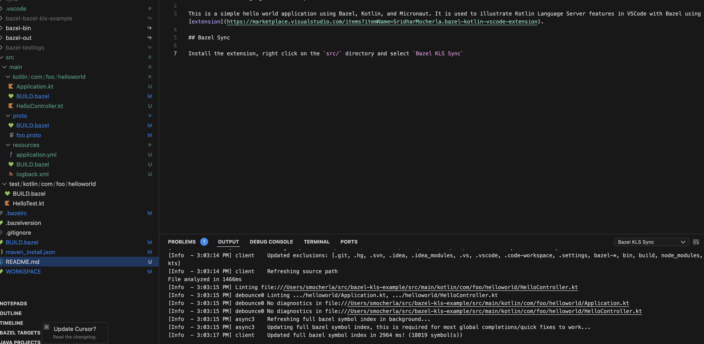
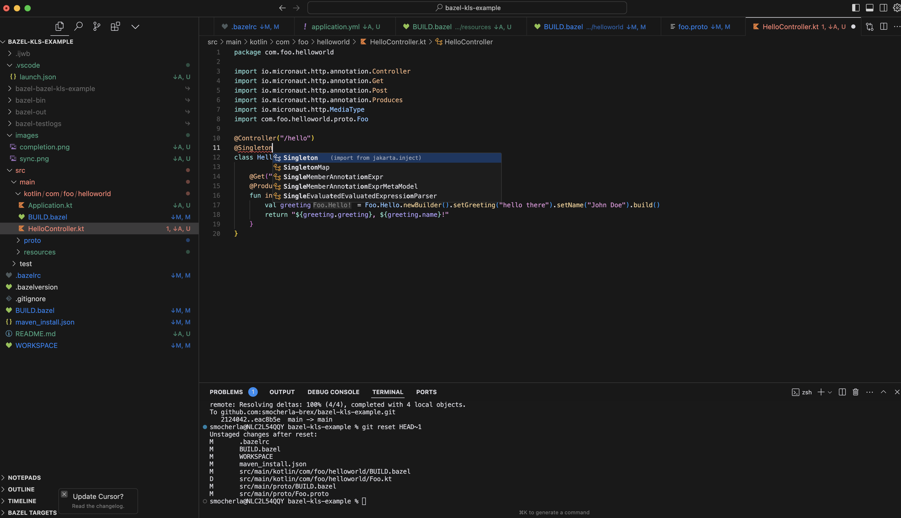

## Bazel Kotlin Language Server Example

This is a simple hello world application using Bazel, Kotlin, and Micronaut. It is used to illustrate Kotlin Language Server features in VSCode with Bazel using the [extension](https://marketplace.visualstudio.com/items?itemName=SridharMocherla.bazel-kotlin-vscode-extension).

## Bazel Sync

Install the extension, right click on the `src/` directory and select `Bazel KLS Sync`. It will trigger a build and refresh the classpath, and then index the symbols as seen below.



Now you can see the syntax highlighing and code completion working as expected as seen below.



## Running the application

To run the application, you can use the following command.

```bash
bazel run //src/main/kotlin/com/foo/helloworld:app
```

